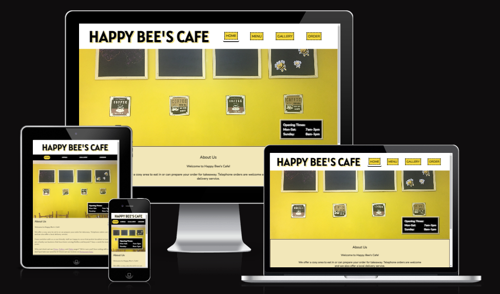

# Happy Bee's Cafe Website

### [Click here to view the live web application!](https://jts272.github.io/pp1-happy-bees-cafe/index.html) 

(Middle click or right click to open in a new tab)

---

Welcome to Happy Bee's Cafe!

This documentation covers the interactive front-end web application for a cafe based in Halifax, West Yorkshire. It is built entirely with HTML5 and CSS3 for educational purposes, with permission and zero compensation.

Throught development of the project, I bore in mind my principles of CARE:

- Cohesive
- Accessible
- Responsive
- Essential

We will discover how these guiding principles formed the basis of my first web application project to create an appealing, logical and valuable product.

By the end of this document, we will have covered:

- UX (User Experience) development
- Testing of the application throughout development, implementation and deployment stages
- Deployment method to a cloud-based platform (GitHub Pages)
- Code structure and organization to maximize maintainability for the future
- Version control process
- Development learning opportunities and ideas for future implementations

---

## Table of Contents

- [User Experience (UX)](#user-experience-ux)
  - [User Stories](#user-stories)

- [Design Process](#design-process)
  - [Wireframes](#wireframes)
  - [Typography](#typography)
  - [Colour Palette](#colour-palette)
  - [Imagery](#imagery)

- [Features](#features)
  - [Homepage](#homepage)
    - Header
    - Navigation Bar
    - Hero Image
    - About Us
    - Footer
  - [Menu Page](#menu-page)
    - Menus
  - [Gallery Page](#gallery-page)
    - Image Gallery
  - [Order Page](#order-page)
    - Order Form

- [Validation Testing](#validation-testing)
  - [HTML Testing]
  - [CSS Testing]

- [Unfixed Bugs](#unfixed-bugs)

- [Deployment Strategy](#deployment-strategy)

- [Technologies Used](#technologies-used)

- [Credits](#credits)

---

## User Experience (UX)

Happy Bee's Cafe is a friendly, family run business that offers a seated cafe experience, as well as takeaway and local delivery orders. The website aims to be a complete, up to date hub for what the business offers. Users can expect to find all pertinent information such as menus and pricing, as well as how to get in touch and follow the latest updates on social channels.

The site is built from the ground up to be fully responsive with a 'mobile-first' design philosophy. The appearance and functionality of the site will be built with progressive advancement in mind. This ensures that the user has a positive emotional experience interacting with the site, regardless of their chosen device. [Google](https://developers.google.com/search/mobile-sites/mobile-first-indexing) index and rank pages based on the mobile version so this design choice gears the site to be more SEO-friendly.

The CARE principles are a core part of the development process. The application is for a business with an existing branding and client base, so the website leveraged this in its design. I decided to create a site that is **cohesive** with the interior styling of the cafe itself. This idea is further expounded in the Design Process section.

**Accessibility** should be at the core of any web application. I want the full features of the site to be useable for as many users as possible. This principle is reflected through use of properly contrasting colours and effective use of accessiblity features of HTML5. Web accessiblity tools have been used through design and testing to ensure compliance.

**Responsiveness** is table stakes for web design in the current era, as espoused by web designer [Ethan Marcotte](https://www.youtube.com/watch?v=4twHFfU44uE). I want to provide the user with an experience that is not compromised by their device. To this end, I have chosen a [Mobile First Design](https://www.youtube.com/watch?v=JcaX60ZscgA) (MFD) for the application. The design process will further explain my approach.

Tying the above concepts together is the focus on keeping the focus of the application **essential**. In short, what needs to be there *is* there and anything which does not aid the aims of the application is discarded. I have found this philosophy to be at the heart of MFD as there is less screen real-estate for overly elaborate features and designs.

### User Stories

The website exists for the benefit of the business owners, thier current customers and future customers. The goals outlined below shows the purpose of the site from those perspectives:

- Client Goals:
  - For potential customers to find the cafe
  - For potential customers to place and order by telephone or form
  - To project a positive brand image to attract customers to visit
  - To keep current customers in the loop and up to date

- First Time Visitor Goals:
  - To easily find the location of the cafe
  - To see what food is on offer
  - To view the price of the food on offer
  - To see the eating in area
  - To see that there is an order function

- Returning Visitor Goals:
  - To have the ability to place customised orders for collection
  - To have the ability to place customised orders for delivery
  - To have the most up to date information on pricing

- Frequent Visitor Goals:
  - To be able to follow the cafe's social media channels to connect further
  - To use the order form to be able to place an order for event catering

The cafe is open from morning to early afternoon. It is situated on a busy road on the outskirts of Halifax. Customers coming in on a typical day could include local school pupils, passing tradespeople or an older couple for lunch. It serves a broad range of people so the website's design and values must cater to this.

---

## Design Process

I followed the 5 planes of UX to determine the course of the project before ever writing a line of code. The 5 planes are as follows:

- Strategy
- Scope
- Structure
- Skeleton
- Surface

### Strategy

The strategy was to keep the content relevant to those who would use it and to serve the needs of the business. I conducted a brief stakeholder meeting of sorts with the cafe owner. I learned a bit more about the business and its customers to make the copy of the website in line with customer's expectations.

As the cafe did not have a website before, nor was there much competition in the immediate vicinity, I looked online to conduct an existing product audit. I took inspiration from [The Pottery Cafe](https://thepotterycafe.co.uk/). Although different in nature from a conventional cafe, I found the general page layout, footer format and gallery layout to be of a professional standard that I should be aiming for. The site also responded well to resizing of the browser window.

The B2C format best describes the business style. Although food orders and catering is available for business, they are still customers in the conventional sense. I wanted to project a friendly image that mirrors the cafe's family friendly reputation.

### Scope

It was essential to determine the scope of the project from the beginning - what is in and what is out? The function of the site from different perspectives were detailed in the user stories and the application must meet these needs in form and function.

The functional requirements are addressed in the [features](#features) section. The principle of essentialism helped to guide the project in the right direction, preventing scope creep from being a threat. As my first web application especially, iteration and refinement was a key part of the design process as I was learning and improving as the project progressed. I feel that the needs of the project were completely satisfied.

### Structure

At this level, I looked at the organization of content and features. This entailed how that pages were structured and how the user would navigate them. Interaction Design (IXD) was at the forefront of this design phase. Users have expectations for how to navigate websites on their chosen device. The key was to leverage their expectations. The flow of pages is consistency and no luck is involved with how the user may interact with the application. Examples of this include having the body text on the homepage 'below the fold' to encourage the user to scroll down to read more after the hero image captures their attention. For desktop users, social calls to action change colour on mouse hover to highlight where they are and that action can be taken.

### Wireframes

### Typography

### Colour Palette

### Imagery

---

## Features:

### Homepage:
- Header
  - The company name and logo is featured prominently. As the user would expect, clicking this navigates back to the homepage.
- Navigation Bar
  - This includes easily identifiable links to the various pages of the site. The currently active page will have its link highlighted to confirm to the user which page they are on.
- Hero Image
  - This section intends to capture the user's attention and immediately inform them of the site's purpose. Opening times overlay an image of the seating area so that the most important information is presented immediately.
- About Us
  - Here is detailed relevant information about what the business offers. The aim is to make the user feel positive and welcomed. The potential customer should find that they will be well catered to and that this is a place they would be happy to visit.
- Footer
  - The page finishes with valuable information such as address, contact information and social links. There are calls to action for the user to connect with the business by finding the location on Google Maps or to follow the Facebook page. An easily accessible button to return to the top affords mobile users a swift viewing experience by sending them back to the navigational links.

---

*The Header, Navigation Bar and Footer are consistent elements on every page.* The user would expect to know which page they are on and how to easily access the other pages of the site. The key features of their respective pages are detailed below:

---

### Menu page:
- Menus
  - Meals and pricing are displayed clearly and unambiguously.

### Gallery page:
- Image Gallery
  - A responsive image gallery shows the user the variety and quality of the food, as well as the seating environment.

### Order page:
- Order Form
  - This form gives the user a way to interact in placing a custom order. Wether for a workplace lunch or a fully catered event, the customer can send their request to be prepared.

---

## Testing
tbw

## Validation Testing
- HTML
  - tbw
- CSS
  - tbw

---

## Unfixed Bugs
tbw

---

## Deployment Strategy
tbw

---

## Technologies Used
tbw

---

## Credits
tbw

[Return to top](#happy-bees-cafe-website)